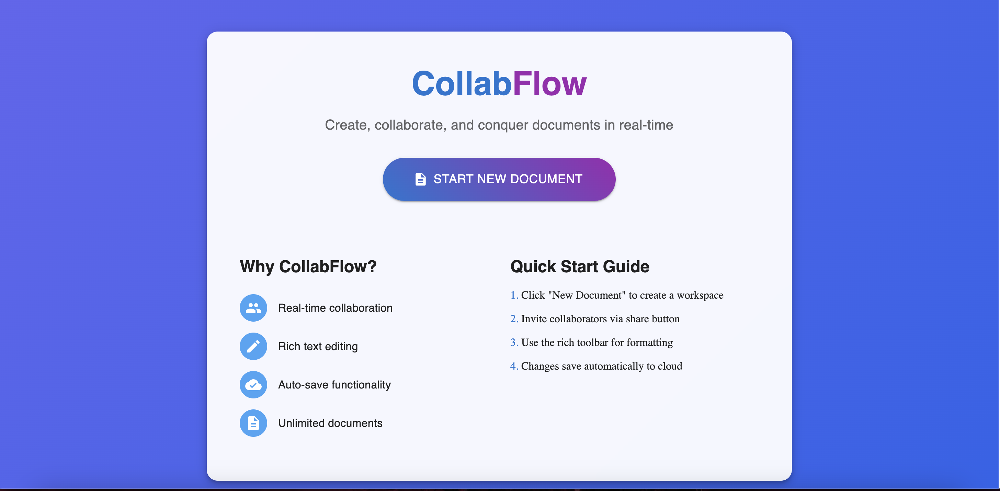
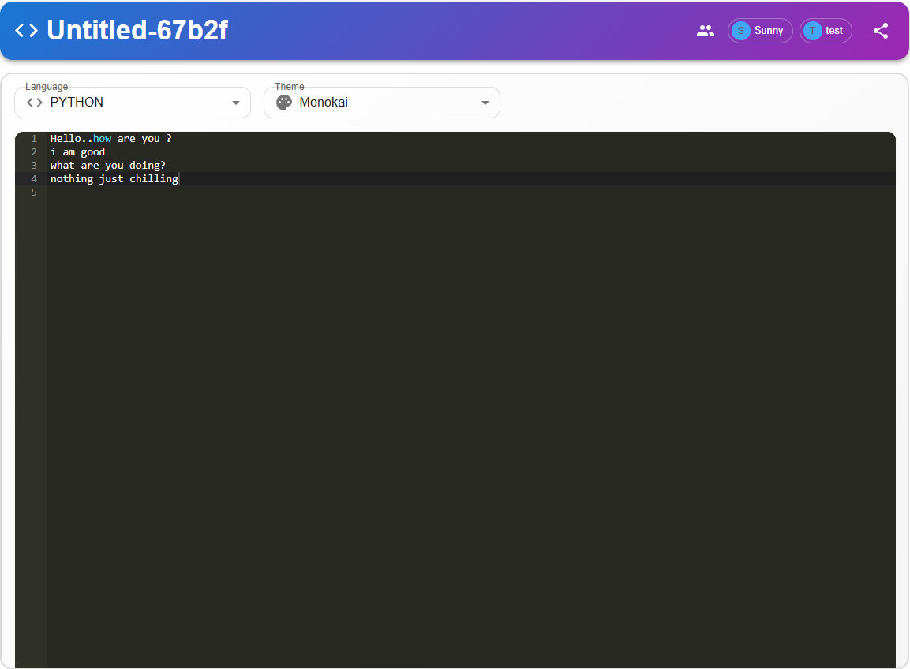

# CollabFlow - Real-Time Collaborative Document Editor

[](https://opensource.org/licenses/MIT)
[](https://www.mongodb.com/mern-stack)
[](https://kafka.apache.org/)

A feature-rich collaborative document editor with real-time synchronization, built with the MERN stack (MongoDB, Express, React, Node.js) and Apache Kafka.

 <!-- Add your screenshot path here -->

## ✨ Features

- **Real-time Collaboration** - Multiple users can edit simultaneously
- **Syntax Highlighting** - Support for 8+ programming languages
- **Theme Selection** - Multiple editor themes (GitHub, Monokai, etc.)
- **Version Control** - Document history tracking
- **User Presence** - See active collaborators in real-time
- **Auto-Save** - Never lose your work
- **Responsive Design** - Works on all screen sizes

## 🚀 Quick Start

### Prerequisites
- Docker

### Installation

1. **Clone the repository**
```bash
git clone https://github.com/thesunnysinha/collabflow.git
cd collabflow
```

4. **Start development servers**
```bash
docker compose up --build
```


### 🛠 Technology Stack

## Frontend

- React with Hooks

- Material-UI

- Socket.IO Client

- Ace Editor

- Framer Motion

## Backend

- Node.js & Express

- MongoDB & Mongoose

- Apache Kafka

- Socket.IO Server

## DevOps

- Docker

- KafkaJS

- Concurrent saves handling

### 📖 Usage
1. **Create Document**

    - Click "New Document" from homepage

    - Set title, language, and theme

    - Start editing!

2. **Collaborate**

    - Share document ID with collaborators

    - See real-time cursor positions

    - Chat integration (coming soon)

3. **Edit Features**

    - Change language syntax highlighting

    - Switch editor themes

    - Use keyboard shortcuts

### 📸 Screenshots

Home Page


Editor



### 🤝 Contributing
We welcome contributions! Please follow these steps:

1. Fork the repository

2. Create your feature branch (git checkout -b feature/awesome-feature)

3. Commit your changes (git commit -m 'Add awesome feature')

4. Push to the branch (git push origin feature/awesome-feature)

5. Open a Pull Request

### 📄 License
This project is licensed under the MIT License - see the LICENSE file for details.

### 🙏 Acknowledgments
- MERN Stack community

- Apache Kafka documentation

- Material-UI component library

- Ace Editor team
