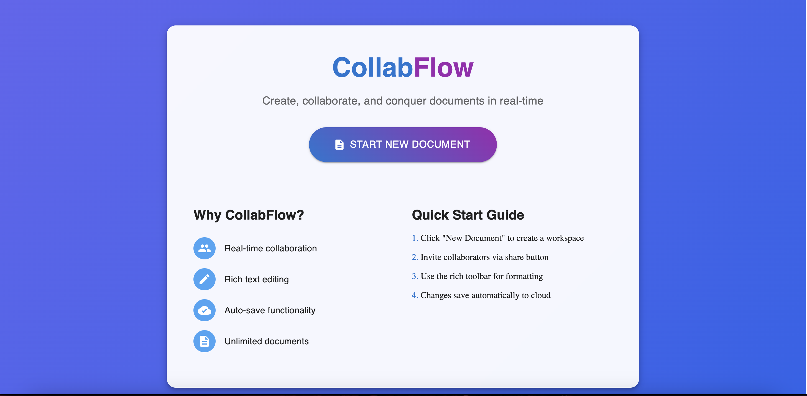
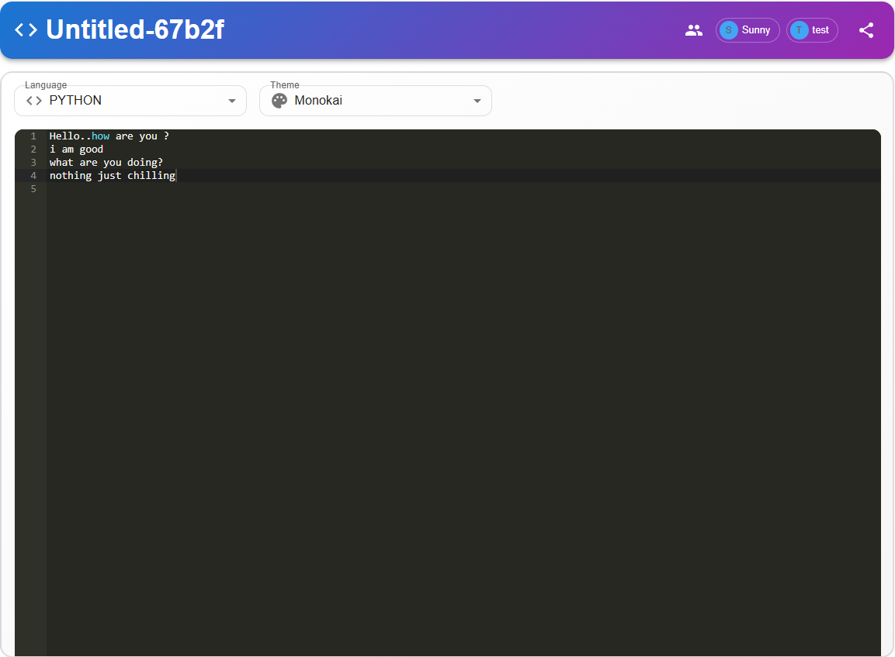

# CollabFlow - Real-Time Collaborative Document Editor

[](https://opensource.org/licenses/MIT)
[](https://www.mongodb.com/mern-stack)
[](https://kafka.apache.org/)

A feature-rich collaborative document editor with real-time synchronization, built with the MERN stack (MongoDB, Express, React, Node.js) and Apache Kafka.

 <!-- Add your screenshot path here -->

## ✨ Features

- **Real-time Collaboration** - Multiple users can edit simultaneously
- **Syntax Highlighting** - Support for 8+ programming languages
- **Theme Selection** - Multiple editor themes (GitHub, Monokai, etc.)
- **Version Control** - Document history tracking
- **User Presence** - See active collaborators in real-time
- **Auto-Save** - Never lose your work
- **Responsive Design** - Works on all screen sizes

## 🚀 Quick Start (development)

Prerequisites: Docker with Compose v2.

1. Create a GitHub OAuth App (GitHub > Settings > Developer settings > OAuth Apps) with homepage
   `http://localhost:3000` and callback URL `http://localhost:3000/api/auth/github/callback`.
2. ```bash
   git clone https://github.com/thesunnysinha/collabflow.git
   cd collabflow
   ./dev.sh   # creates .env on first run; add GITHUB_CLIENT_ID / GITHUB_CLIENT_SECRET, then run again
   ```

Open http://localhost:3000, sign in with GitHub, and create a document. Kafdrop is at http://localhost:9000.

## 🏭 Production deployment

1. Point your domain's DNS at the server and open ports 80/443 (and 443/udp).
2. Create a GitHub OAuth App with homepage `https://your.domain` and callback URL
   `https://your.domain/api/auth/github/callback`.
3. Create the environment file and fill in the secrets and the OAuth client id/secret:
   ```bash
   cp .env.example .env
   # DOMAIN=your.domain  JWT_SECRET=$(openssl rand -hex 32)  MONGO_PASSWORD=$(openssl rand -hex 16)
   ```
4. Start the stack: `docker compose up -d --build`

Caddy obtains and renews the TLS certificate automatically. Only ports 80/443 are published;
MongoDB, Kafka and ZooKeeper are reachable only on the internal Docker network. Data lives in named
volumes (`mongo_data`, `kafka_data`, ...) - **back up `mongo_data`** (e.g. `mongodump`) on a schedule.

Health endpoints: `/healthz` (liveness) and `/readyz` (MongoDB + Kafka readiness) on the backend.
Logs are structured JSON (pino) and rotate via Docker's json-file driver.

### Security model
- Sign-in is GitHub OAuth only (no passwords are stored). The OAuth `state` is signed and bound to the
  browser by an httpOnly cookie. The app issues short-lived (1h) JWTs; auth endpoints are rate limited.
- Every document has an owner and optional collaborators. Only they can read or edit it
  (others get 404); only the owner can share or delete. WebSockets authenticate during the handshake.
- The server never trusts client-supplied identity, field names or sizes.

### Known limitations
- **Single backend instance.** Presence and Socket.IO rooms are in-process; scaling out needs the
  Socket.IO Redis adapter.
- **Last-write-wins editing.** Concurrent edits to the same document replace each other (no OT/CRDT).
- Single-broker Kafka (replication factor 1); fine for one VM, not for HA.
- JWTs are stored in `localStorage` and are not revocable before expiry. Accounts are matched by GitHub
  user id; collaborators are added by GitHub username. Accounts from the old password login are not migrated.

### CI/CD
`.github/workflows/ci.yml` runs backend tests, an `npm audit`, the frontend build and Docker builds on
every PR. Pushes to `main` run CI and then deploy (`deploy_to_vm.yml`). **The server needs its own `.env`**
(it is no longer committed to the repository).

## Tests
```bash
cd services/backend && npm test
```

### 🛠 Technology Stack

## Frontend

- React with Hooks

- Material-UI

- Socket.IO Client

- Ace Editor

- Framer Motion

## Backend

- Node.js & Express

- MongoDB & Mongoose

- Apache Kafka

- Socket.IO Server

## DevOps

- Docker

- KafkaJS

- Concurrent saves handling

### 📖 Usage
1. **Create Document**

    - Click "New Document" from homepage

    - Set title, language, and theme

    - Start editing!

2. **Collaborate**

    - Share document ID with collaborators

    - See real-time cursor positions

    - Chat integration (coming soon)

3. **Edit Features**

    - Change language syntax highlighting

    - Switch editor themes

    - Use keyboard shortcuts

### 📸 Screenshots

Home Page


Editor



### 🤝 Contributing
We welcome contributions! Please follow these steps:

1. Fork the repository

2. Create your feature branch (git checkout -b feature/awesome-feature)

3. Commit your changes (git commit -m 'Add awesome feature')

4. Push to the branch (git push origin feature/awesome-feature)

5. Open a Pull Request

### 📄 License
This project is licensed under the MIT License - see the LICENSE file for details.

### 🙏 Acknowledgments
- MERN Stack community

- Apache Kafka documentation

- Material-UI component library

- Ace Editor team
